# Diagramme de la Base de Données Vetoptim

## Relations Principales

```mermaid
erDiagram
    PERSONS {
        uniqueidentifier PersonId PK
        varchar PersonType
        nvarchar Email
        nvarchar FirstName
        nvarchar LastName
        varchar Mobile
        varchar Phone
        date BirthDate
        uniqueidentifier BusinessGroupId FK
    }
    
    JURIDICALENTITIES {
        uniqueidentifier JuridicalEntityId PK
        nvarchar JuridicalEntityType
        nvarchar Siret
        nvarchar Siren
        bit IsCustomer
        nvarchar CompanyName
        uniqueidentifier Address_city FK
    }
    
    CONTRACTS {
        uniqueidentifier ContractId PK
        uniqueidentifier Customer FK
        uniqueidentifier SigningAccount FK
        uniqueidentifier BrokerAccount FK
        nvarchar StatusCode
        nvarchar ReferenceVetoptim
        datetime Input_EffectDate
        bigint Input_CA
        uniqueidentifier CurrentRevision FK
    }
    
    PROJECTS {
        uniqueidentifier ProjectId PK
        uniqueidentifier PersonId FK
        uniqueidentifier JuridicalEntityId FK
        uniqueidentifier Broker FK
        uniqueidentifier Commercial FK
        nvarchar Label
        nvarchar StatusCode
        nvarchar ReferenceVetoptim
        decimal Amount
        decimal CommissionRate
        uniqueidentifier ProductId FK
    }
    
    APPOINTMENTS {
        uniqueidentifier AppointmentId PK
        varchar Subject
        varchar ContactType
        uniqueidentifier ContactId FK
        datetime StartDate
        datetime EndDate
        varchar Location
        uniqueidentifier PersonId FK
        uniqueidentifier JuridicalEntityId FK
        uniqueidentifier ContractId FK
    }
    
    TASKS {
        uniqueidentifier TaskId PK
        nvarchar Subject
        nvarchar Message
        uniqueidentifier SuiviPar FK
        date DateEcheance
        uniqueidentifier ProjectId FK
        uniqueidentifier PersonId FK
        uniqueidentifier JuridicalEntityId FK
        uniqueidentifier ContractId FK
    }
    
    NOTES {
        uniqueidentifier NoteId PK
        uniqueidentifier ProjectId FK
        uniqueidentifier PersonId FK
        uniqueidentifier JuridicalEntityId FK
        uniqueidentifier ContractId FK
        nvarchar Title
        nvarchar Message
        bit IsPrivate
    }
    
    ECHANCES {
        uniqueidentifier EcheanceId PK
        uniqueidentifier Revision FK
        date EcheanceDate
        nvarchar Title
        decimal Amount
        nvarchar PaidStatusCode
        uniqueidentifier Contract FK
    }
    
    BANKS {
        uniqueidentifier BankId PK
        uniqueidentifier PersonId FK
        uniqueidentifier JuridicalEntityId FK
        bit IsDefaultBank
        nvarchar Libelle
        nvarchar IBAN
        nvarchar BIC
    }
    
    CITIES {
        uniqueidentifier CityId PK
        nvarchar PostalCode
        nvarchar Label
        uniqueidentifier Department FK
        numeric Longitude
        numeric Latitude
        varchar CodeInsee
    }
    
    DEPARTMENTS {
        uniqueidentifier DepartmentId PK
        nvarchar Code
        nvarchar Label
        uniqueidentifier Region FK
        uniqueidentifier VetoptimRegion FK
    }
    
    COLLABORATORS {
        uniqueidentifier CollaboratorId PK
        nvarchar VetoptimCode
        nvarchar CompanyName
        nvarchar FirstName
        nvarchar LastName
        nvarchar Email
        varchar Mobile
        varchar Phone
        uniqueidentifier Responsable FK
        uniqueidentifier Role FK
    }
    
    COMPANIES {
        uniqueidentifier CompanyId PK
        varchar CompanyName
        varchar Web
        varchar Phone
        varchar Email
        uniqueidentifier Address_city FK
    }
    
    PRODUCTS {
        uniqueidentifier ProductId PK
        nvarchar Label
        varchar EntityCode
        nvarchar Code
        nvarchar Parcours
        varchar Rubrique
    }

    %% Relations
    PERSONS ||--o{ PROJECTS : "PersonId"
    PERSONS ||--o{ APPOINTMENTS : "PersonId"
    PERSONS ||--o{ TASKS : "PersonId"
    PERSONS ||--o{ NOTES : "PersonId"
    PERSONS ||--o{ BANKS : "PersonId"
    PERSONS ||--o{ COLLABORATORS : "Responsable"
    
    JURIDICALENTITIES ||--o{ PROJECTS : "JuridicalEntityId"
    JURIDICALENTITIES ||--o{ APPOINTMENTS : "JuridicalEntityId"
    JURIDICALENTITIES ||--o{ TASKS : "JuridicalEntityId"
    JURIDICALENTITIES ||--o{ NOTES : "JuridicalEntityId"
    JURIDICALENTITIES ||--o{ BANKS : "JuridicalEntityId"
    JURIDICALENTITIES ||--o{ CITIES : "Address_city"
    
    CONTRACTS ||--o{ APPOINTMENTS : "ContractId"
    CONTRACTS ||--o{ TASKS : "ContractId"
    CONTRACTS ||--o{ NOTES : "ContractId"
    CONTRACTS ||--o{ ECHANCES : "Contract"
    CONTRACTS ||--o{ PROJECTS : "Customer"
    
    PROJECTS ||--o{ TASKS : "ProjectId"
    PROJECTS ||--o{ NOTES : "ProjectId"
    PROJECTS ||--o{ PRODUCTS : "ProductId"
    
    CITIES ||--o{ DEPARTMENTS : "Department"
    CITIES ||--o{ JURIDICALENTITIES : "Address_city"
    CITIES ||--o{ COMPANIES : "Address_city"
```

## Description des Tables Principales

### 🏢 **Entités Métier**
- **PERSONS** : Personnes physiques (prospects, clients, collaborateurs)
- **JURIDICALENTITIES** : Entités juridiques (entreprises, sociétés)
- **COLLABORATORS** : Collaborateurs internes Vetoptim
- **COMPANIES** : Compagnies d'assurance partenaires

### 📋 **Gestion Commerciale**
- **PROJECTS** : Projets commerciaux et opportunités
- **CONTRACTS** : Contrats d'assurance
- **ECHANCES** : Échéances de paiement
- **PRODUCTS** : Produits d'assurance

### 📅 **Suivi et Communication**
- **APPOINTMENTS** : Rendez-vous et réunions
- **TASKS** : Tâches et actions à suivre
- **NOTES** : Notes et commentaires

### 🏦 **Gestion Financière**
- **BANKS** : Informations bancaires des clients

### 🌍 **Géographie**
- **CITIES** : Villes et communes
- **DEPARTMENTS** : Départements et régions

## Relations Clés

1. **PERSONS ↔ PROJECTS** : Une personne peut avoir plusieurs projets
2. **JURIDICALENTITIES ↔ CONTRACTS** : Une entité juridique peut avoir plusieurs contrats
3. **PROJECTS ↔ CONTRACTS** : Un projet peut générer un contrat
4. **CONTRACTS ↔ ECHANCES** : Un contrat a plusieurs échéances de paiement
5. **PERSONS/JURIDICALENTITIES ↔ APPOINTMENTS** : Rendez-vous liés aux contacts
6. **PROJECTS ↔ TASKS/NOTES** : Suivi des projets via tâches et notes
